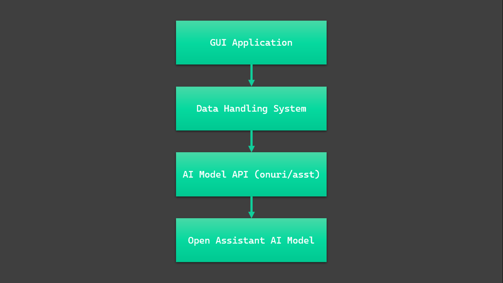
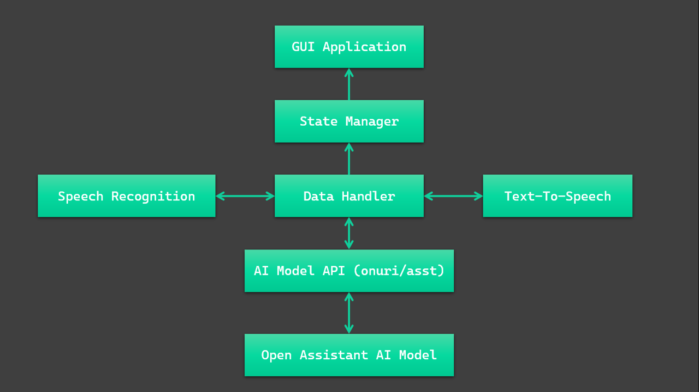
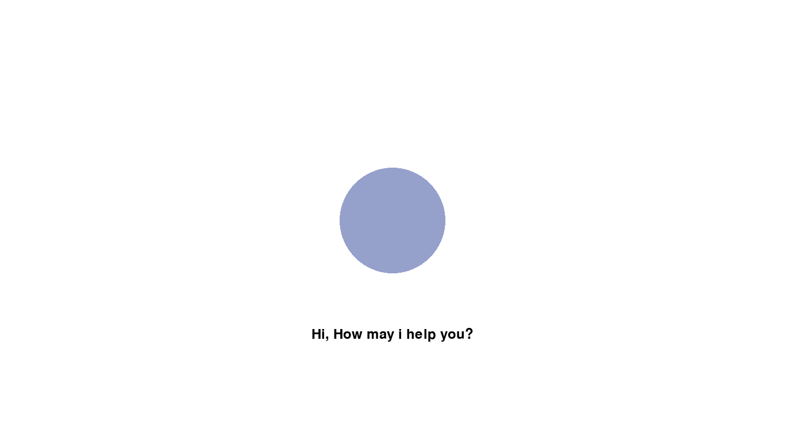

# Presec-AI-Companion

## Table Of Content

- [Presec-AI-Companion](#presec-ai-companion)
  - [Table Of Content](#table-of-content)
  - [What is P.A.C](#what-is-pac)
  - [Prerequisites](#prerequisites)
  - [Installation](#installation)
  - [Usage](#usage)
  - [How It Works](#how-it-works)
  - [Screenshots](#screenshots)
  - [Resources](#resources)

## What is P.A.C

The Presec AI Companion (P.A.C) is an interactive AI based chat bot that uses the power of advance AI tool, OpenAssistant to generate accurate response and Text-Speech technology to create an interactive experience.

## Prerequisites

- python version >= 3.10.6 ( Recomended 3.11.3 )
- pip version >= 22.0 ( Recomended pip 23.1.2 )

## Installation

From the terminal:

1. `git clone https://github.com/pascall-de-creator/Presec-AI-Companion.git`
or download zip file and extract.

2. `cd Presec-AI-Companion` or open in file manager

3. run `pip install -r requirements.txt` in the terminal to install all dependencies

4. Enjoy!!

## Usage

The start point of the project is the app.py file located in the current directory. To launch the application you can simply run:

- Windows:

  ```pwsh
    python app.py
  ```

- linux / MacOS (*nix*):

  ```pwsh
    python3 app.py
  ```

## How It Works

The project runs runs as an application which interacts to several APIs sitting on each other in layers



Data is Transfered to each part of the application as follows:



## Screenshots





## Resources

- [Open Assistant](https://huggingface.co/OpenAssistant/oasst-sft-4-pythia-12b-epoch-3.5)
- [AI API](https://huggingface.co/spaces/onuri/asst)
